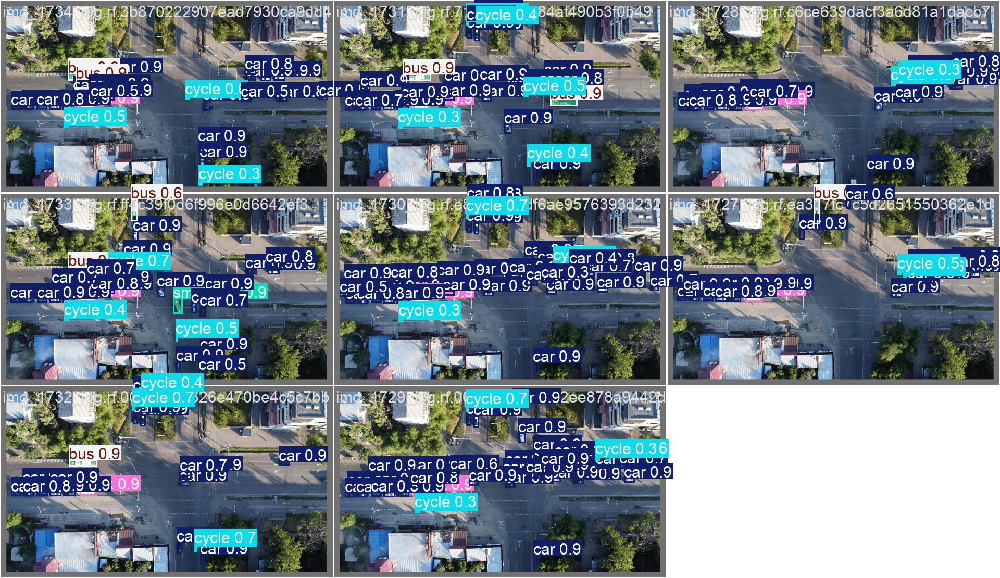
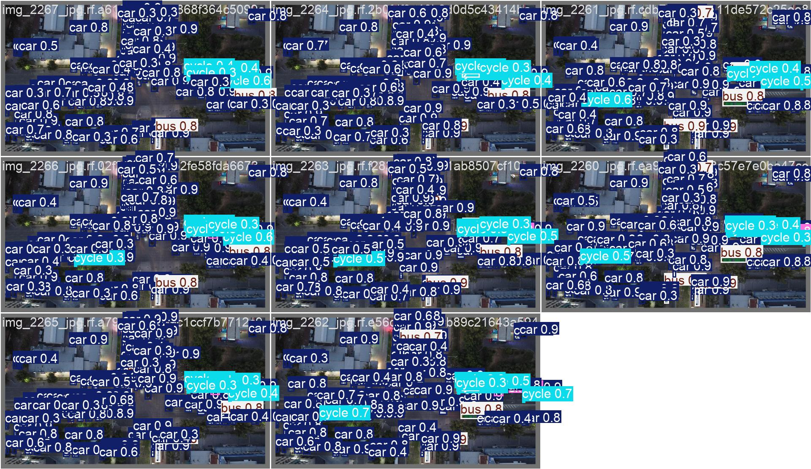

<div align="center">

# YOLO26s + CoordAtt

**Resource-Constrained Aerial Small-Object Detection**

*Detecting 7 classes of tiny targets from drone imagery on an 8 GB consumer laptop GPU*

[](LICENSE)
[](https://www.python.org/downloads/release/python-3110/)
[](https://pytorch.org/)
[](https://github.com/ultralytics/ultralytics)
[](https://developer.nvidia.com/cuda-zone/)

[Key Results](#-key-results) •
[Architecture](#-architecture) •
[Dataset](#-dataset) •
[Ablation](#-ablation-study) •
[Reproduce](#-reproducibility)

</div>

---

## 🔭 Overview

While most computer vision research assumes access to high-end GPUs (A100, 4090) and large-scale
cloud compute, real-world work does not always afford that luxury. Fieldwork, in particular,
means carrying a single laptop into the outdoors — and a laptop GPU carries only a few gigabytes
of VRAM.

This project grew out of exactly that situation: **performing aerial object detection on a
consumer laptop (RTX 5060, 8 GB VRAM) in an outdoor setting**, where upgrading hardware or
renting cloud GPUs is not an option. The guiding question is therefore not *"how high can we push
mAP with unlimited hardware?"* — that is well-studied. It is:

> **How good can detection get under a hard 8 GB VRAM budget, and which design decisions matter
> most under that constraint?**

Every design decision in this project is evaluated by both **accuracy and memory cost**,
documented through **20+ versioned ablation experiments**.

---

## 📊 Key Results

### Best Model — V16.0

<div align="center">

| | |
|:---|:---|
| **mAP@0.5** | **74.00%** |
| **mAP@0.5:0.95** | **52.11%** |
| **Precision** | **81.3%** |
| **Recall** | **67.6%** |
| **Parameters** | **7.03 M** |
| **Inference** | **4.0 ms** |
| **VRAM** | **6.8 GB** (batch=4, imgsz=800) |

<sub>P3+P4 dual-head + per-scale CoordAtt · RTX 5060 8 GB · FP16 · avg over 2,224 val images</sub>

</div>

### Per-Class Performance (V16.0)

| Class | AP@0.5 | AP@0.5:0.95 | Precision | Recall |
|:------|:------:|:-----------:|:---------:|:------:|
| person | 60.2% | 24.7% | 77.7% | 50.9% |
| cycle | 43.0% | 17.6% | 67.0% | 36.3% |
| bus | 91.8% | 74.5% | 91.3% | 86.3% |
| small-bus | 99.2% | 83.3% | 92.3% | 99.4% |
| car | 67.2% | 47.3% | 87.2% | 51.4% |
| truck | 60.0% | 41.0% | 63.8% | 53.6% |
| freight | 96.6% | 76.6% | 89.8% | 95.0% |
| **Overall** | **74.0%** | **52.1%** | **81.3%** | **67.6%** |

### Detection Examples

<p align="center">
  
  
  
</p>

### Training & Evaluation Plots

<p align="center">
  
  
</p>

---

## 🧠 Architecture

The core improvements target three bottlenecks at once — **positional information loss**,
**small-object gradient starvation**, and **VRAM overcommitment** — applied on top of a
customized Ultralytics 8.4.12 fork.

| # | Modification | Targets | Impact |
|:-:|:-------------|:--------|:-------|
| 1 | **Coordinate Attention (CoordAtt)** | Positional info loss | +2.4% Precision, negligible params |
| 2 | **P3+P4 dual-head** | VRAM overcommitment | −32% params, +2.1% mAP on 8 GB |
| 3 | **WIoU v3 loss** | Small-object gradient | +1.78% mAP@0.5, zero VRAM cost |
| 4 | **TAL 4 px threshold** | Small-object assignment | +6–7% on person/cycle |
| 5 | **Class weighting** | Long-tail imbalance | `[2.0, 3.0, 1.8, 1.5, 1.0, 1.0, 1.0]` |

> 📄 All custom modifications are documented in [`patches/README.md`](patches/README.md);
> full CoordAtt source in [`patches/coordatt.py`](patches/coordatt.py).

<details>
<summary><b>Why dual-head beats triple-head on 8 GB</b> (click to expand)</summary>

<br>

A P2 high-resolution head (25,600 cells) would help small objects, but its alignment matrix
in the TaskAlignedAssigner exceeds 8 GB VRAM at batch=4. Removing the P5 head frees ~40% of
detection-head VRAM and 32% of parameters. This memory is reallocated to larger P3/P4 channels,
which improves detection of the majority of targets (person, cycle, car, truck — over 80% of
instances). The trade-off: car detection at the P4→P5 boundary degrades slightly (67.3% vs
~71% on triple-head), which remains an open problem.

</details>

---

## 📁 Dataset

### aerial_v9 (Primary)

| Split | Images | Classes |
|:------|:------:|:-------:|
| Train | 8,075 | 7 |
| Val | 2,224 | 7 |
| Test | 738 | 7 |

**Classes:** `person · cycle · bus · small-bus · car · truck · freight`

**Class distribution (train instances):**

```
person    73,770  ████████████████████████████████████████
car       69,840  ██████████████████████████████████████
cycle     14,356  ████████
truck     13,772  ███████
bus        6,994  ████
freight    1,306  █
small-bus  1,117  █
```

### Dataset History

| Dataset | Images | Classes | Source |
|:--------|:------:|:-------:|:-------|
| **aerial_v9** (current) | 8,075 / 2,224 / 738 | 7 | Curated from public sources, label noise cleaned |
| aerial_v8 (early) | 3,800 | 7 | Public aerial datasets, superseded |
| aerial_merged (early) | 7,148 | 5 | aerial.v1i (CC BY 4.0) + VisDrone2019 |
| aerial (early) | 2,090 | 6 | Roboflow aerial.v1i (CC BY 4.0) |

> **⚠️ Dataset availability**: aerial_v9 is curated from public aerial datasets
> (aerial.v1i CC BY 4.0, Aerial Vehicle Detection MIT, aerial.v3i MIT). Due to license terms and
> total size (~10 GB), the full dataset is **not open-sourced**. Contact the owner for access, or
> prepare a compatible dataset using [`data/data.yaml`](data/data.yaml).
>
> A **50-image CC BY 4.0 subset** is included in [`data/val_samples/`](data/val_samples/) for
> verification. See [`docs/data_cleaning_report.md`](docs/data_cleaning_report.md) for the
> curation process.

---

## 🔬 Ablation Study

Each version isolates exactly one variable. All training on RTX 5060 8 GB, batch=4, SGD lr₀=0.01.

| Version | Key Change | mAP@0.5 | mAP@0.5:0.95 | Δ | Status |
|:-------:|:-----------|:-------:|:------------:|:--:|:------:|
| V8.0 | Baseline (clean aerial_v8, 7 classes) | 67.81% | 44.31% | — | Baseline |
| V8.1 | + WIoU v3 loss | 69.59% | 47.00% | +1.78% | ✅ |
| V10.0 | + CoordAtt + WIoU + aerial_v9 | 70.51% | 49.33% | +0.92% | Milestone |
| V12.0 | imgsz 640 → 800 | 71.58% | 50.27% | +1.07% | ✅ |
| V14.0 | P3+P4 dual-head, imgsz=960 | 73.71% | **52.65%** | +2.13% | Peak mAP₅₀₋₉₅ |
| **V16.0** | **+ per-scale CoordAtt, imgsz=800** | **74.00%** | 52.11% | +0.29% | **🏆 Best** |
| V17.0 | + P4 RepNCSPELAN4 | 73.52% | 51.27% | −0.48% | Neutral |
| V18.0 | + ECA / ASFF attention | 72.91% | 50.84% | −1.09% | Neutral |
| V19.0 | P4 wide channel 256 → 384 | 73.44% | 51.63% | −0.56% | Neutral |
| V20.0 | P3+P4+P5 triple-head (clean) | 73.29% | 50.41% | −0.71% | Neutral |

> 📄 **Complete 20+ version log** with per-class breakdowns, failed experiments, and full training
> configuration → [`docs/ablation_table.md`](docs/ablation_table.md)

<details>
<summary><b>Failed experiments (honest record)</b> (click to expand)</summary>

<br>

| Version | Attempt | Result | Lesson |
|:-------:|:--------|:------:|:-------|
| V4.0 | Freeze + unfreeze 2-stage training | 46.82% | COCO pretrain ≠ aerial features; train from scratch |
| V7.0 | VisDrone noisy data | 55.25% (R=50%) | Data quality > architecture |
| V8.2 | Transfer-learning relay (V8.1 → v9) | 69.71% | lr mismatch destroys learned features |
| V13.0 | P2 high-res head | 66.68% | 8 GB OOM, not viable on consumer GPUs |

</details>

---

## ⚖️ Quantitative Comparison

V16.0 vs standard baselines under identical conditions (aerial_v9, imgsz=800, batch=4, 200 epochs).

| Model | mAP@0.5 | mAP@0.5:0.95 | Params | VRAM (bs=4) | Notes |
|:------|:-------:|:------------:|:------:|:-----------:|:------|
| YOLOv8s (vanilla) | 70.21% | 48.55% | 11.1 M | 6.2 GB | Standard triple-head baseline |
| YOLOv8s-p2 | — | — | 11.1 M | **OOM** | P2 head fails allocation on 8 GB |
| **YOLO26s + CoordAtt (V16)** | **74.00%** | **52.11%** | **7.03 M** | **6.8 GB** | Dual-head + per-scale CoordAtt |
| VisDrone2019 SOTA (YOLOv8s-p2) | ~43.7% | — | 11.1 M | — | Public benchmark, 10-class, *different dataset* |

**Takeaways:**

- V16 beats YOLOv8s by **+3.79%** mAP@0.5 with **37% fewer parameters** (7.03 M vs 11.1 M).
- YOLOv8s-p2 — the standard solution for small objects — **cannot run on 8 GB VRAM**. The dual-head
  design is not a preference; it is a necessity under this constraint.
- The VisDrone comparison is across a *different dataset* and should not be read as a direct gap.

---

## 🚀 Reproducibility

<details open>
<summary><b>⚡ Quick verification (no GPU, 50-image sample)</b></summary>

<br>

A 50-image CC BY 4.0 subset is included in [`data/val_samples/`](data/val_samples/).

```bash
# 1. Check dependencies
python -c "import torch, ultralytics; print('OK')"

# 2. Validate model configs
python -c "import yaml, os; [yaml.safe_load(open(f'configs/{c}')) for c in os.listdir('configs') if c.endswith('.yaml')]; print('All configs valid')"

# 3. Run inference on the sample set (needs best.pt from Releases)
python scripts/eval.py --weights best.pt --data data/val_samples/val_data.yaml --name sample_verify
```

</details>

<details>
<summary><b>🔧 Full training (V16, ~16.6 h on RTX 5060)</b></summary>

<br>

```bash
# Environment
conda create -n yolo_new python=3.11
conda activate yolo_new
pip install -r requirements.txt          # base ultralytics==8.4.12
# → then apply patches/ to add CoordAtt, WIoU v3, TAL 4px

# Prepare data — edit data/data.yaml to point at your aerial_v9 directory

# Train
python scripts/train_v16.py

# Evaluate
python scripts/eval.py --weights runs/detect/runs/aerial_train/yolo26s_v16/weights/best.pt \
                       --data data/data.yaml
```

</details>

> **Model weights** — download `best.pt` from
> [**GitHub Releases**](https://github.com/ZHY9981/aerial-yolo26s/releases) (~15 MB).

### Hardware Constraints

| Constraint | Effect | Solution |
|:-----------|:-------|:---------|
| RTX 5060 Laptop · 8 GB | Forces batch=4, blocks P2 head | P3+P4 dual-head architecture |
| Fixed (not purchasable) | Cannot relax via hardware | Every design evaluated by accuracy **and** memory cost |

---

## 💡 Key Findings

1. **Data > Architecture** — switching from noisy VisDrone to curated aerial_v9 gave **+12.56%**
   mAP@0.5, more than all architectural changes combined.
2. **Attention is cheap but effective** — CoordAtt adds negligible params but **+2.4%** Precision.
3. **Dual-head beats triple-head on 8 GB** — removing P5 saves 32% params and ~40% VRAM while
   *improving* mAP by **+2.1%**. Counterintuitive but reproducible under the memory constraint.
4. **Assignment threshold matters for small objects** — TAL 4 px (vs default 8 px) directly boosted
   person/cycle by **+6–7%**.

---

## 📂 Repository Structure

```
aerial-yolo26s/
├── configs/                          # Model architecture definitions
│   ├── yolo26s-v16-p34-coordatt.yaml #   ← best model (V16)
│   ├── yolo26s-v17-repncsp4.yaml
│   ├── yolo26s-v18-asff.yaml
│   ├── yolo26s-v19-widep4.yaml
│   └── yolo26s-v20-ppa-dysample.yaml
├── scripts/
│   ├── train_v16.py                  # Training entry point
│   └── eval.py                       # Evaluation with full metrics
├── patches/                          # Custom Ultralytics modifications
│   ├── README.md                     #   ← detailed modification log
│   └── coordatt.py                   #   ← CoordAtt module source
├── data/
│   ├── data.yaml                     # Dataset config (edit path for local use)
│   └── val_samples/                  # 50-image CC BY 4.0 verification subset
├── docs/
│   ├── ablation_table.md             # Complete 20+ version log
│   ├── data_cleaning_report.md       # Data curation examples
│   ├── technical_report.pdf          # 7-page technical report
│   └── technical_report.tex          # LaTeX source
├── results/                          # Plots and visualizations
└── requirements.txt
```

---

## 📖 Citation

```bibtex
@misc{aerial_yolo26s_2026,
  title        = {Resource-Constrained Aerial Small Object Detection with YOLO26s + CoordAtt},
  author       = {Zou, Haoyi},
  year         = {2026},
  url          = {https://github.com/ZHY9981/aerial-yolo26s}
}
```

## 📜 License

Released under the [MIT License](LICENSE).

<div align="center">
<sub>Built with PyTorch · Ultralytics · CUDA &nbsp;|&nbsp; Developed on RTX 5060 Laptop 8 GB</sub>
</div>
