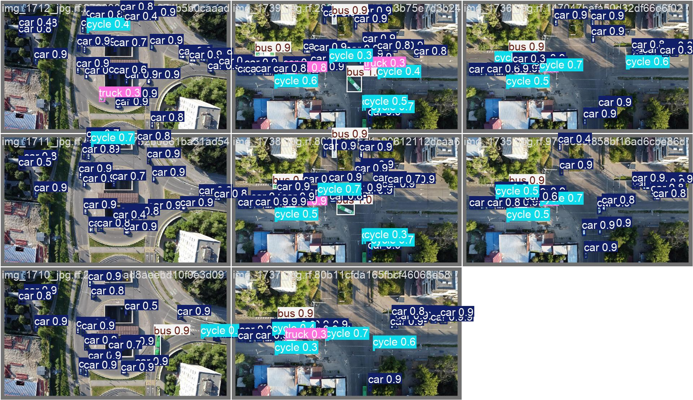
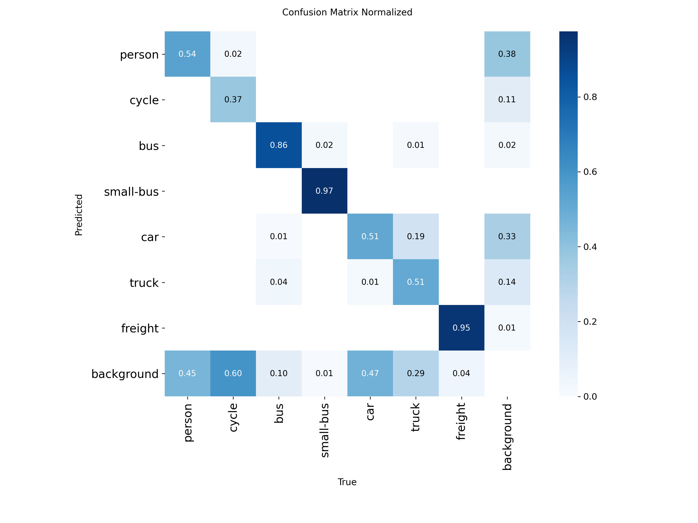
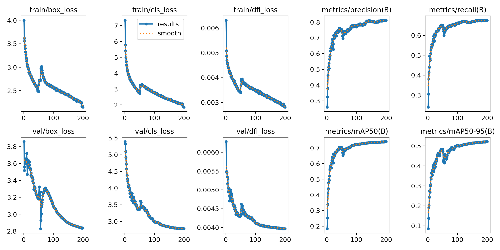

# YOLO26s + CoordAtt: Resource-Constrained Aerial Small-Object Detection

> Real-time detection of 7 object classes from drone imagery, optimized for 8 GB VRAM consumer GPUs.

[](LICENSE)

## Overview

This project explores aerial small-object detection using a customized YOLO26s architecture,
specifically engineered for resource-constrained deployment scenarios. The key challenge:
detecting tiny targets (pedestrians, cyclists, vehicles) in high-resolution drone footage while
fitting within an **8 GB VRAM budget** (RTX 5060 Laptop GPU).

Rather than scaling up hardware, every design decision is evaluated by both accuracy and memory
cost — a discipline forced by the fixed hardware constraint and documented through 20+ versioned
ablation experiments.

**Best model (V16.0):**

| Metric | Value | Note |
|--------|-------|------|
| mAP@0.5 | **74.00%** | V16 (P3+P4 dual-head + CoordAtt), imgsz=800 |
| mAP@0.5:0.95 | **52.11%** | V16 |
| mAP@0.5:0.95 (peak) | **52.65%** | V14 (P3+P4 dual-head, imgsz=960) |
| Parameters | **7.03 M** | V16 |
| Precision | **81.3%** | V16 validation |
| Recall | **67.6%** | V16 validation |
| Inference | **4.0 ms** | RTX 5060 8 GB, imgsz=800, FP16 (avg over 2,224 val images) |

### Detection Examples





### Training Curves



---

## Motivation & Real-World Significance

While most computer vision research assumes access to high-end GPUs (A100, 4090) and large-scale
cloud compute, real-world work does not always afford that luxury. Fieldwork, in particular,
means carrying a single laptop into the outdoors — and a laptop GPU carries only a few gigabytes
of VRAM. This project grew out of exactly that situation: performing aerial object detection on
a consumer laptop (RTX 5060, 8 GB VRAM) in an outdoor setting, where upgrading hardware or
renting cloud GPUs is not an option.

The question this project asks is therefore not "how high can we push mAP with unlimited
hardware?" — that is well-studied. The question is: **"How good can detection get under a hard
8 GB VRAM budget, and which design decisions matter most under that constraint?"**

The applicant holds a CAAC Beyond-Visual-Line-of-Sight (BVLOS) UAV operator license, which
provides first-hand domain knowledge of real drone flight conditions — altitude constraints,
camera angles, and image distortion. Understanding *why* aerial small-object detection matters
comes from operating drones, not just reading papers about them.

This project is an attempt to bridge that gap — applying rigorous, systematically ablated
computer vision research to a problem defined by real-world deployment constraints.

---

## The Problem

Aerial small-object detection is hard for three compounding reasons:

- **Tiny targets**: a pedestrian viewed from 100 m+ altitude occupies < 30 pixels — < 1% of the
  image. Standard detection heads routinely miss them.
- **OOM on consumer GPUs**: adding a high-resolution P2 head (25,600 cells) to capture small
  objects causes the TaskAlignedAssigner to allocate an alignment matrix that exceeds 8 GB VRAM
  at batch=4 — the constraint cannot be relaxed by buying hardware.
- **Class imbalance**: person/car dominate; freight and small-bus are rare (each < 2% of instances).

---

## Architecture Modifications

The core improvements target three bottlenecks at once: **positional information loss** (CoordAtt),
**small-object gradient starvation** (WIoU v3, TAL 4px), and **VRAM overcommitment** (P3+P4 dual-head).
All modifications are applied on top of a customized Ultralytics 8.4.12 fork.

1. **Coordinate Attention (CoordAtt)** — injects positional information into channel attention.
   +2.4% Precision gain, negligible parameter cost. Placed per-scale at P3 and P4 neck for
   direct spatial enhancement.
2. **P3+P4 dual-head** — removed the P5 head; reduced parameters by 32% while improving mAP by
   +2.1% on 8 GB hardware. Chosen over triple-head as the production architecture.
3. **WIoU v3 loss** — weighted IoU for better small-object gradient. +1.78% mAP@0.5, zero VRAM cost.
4. **TAL 4 px threshold** — TaskAlignedAssigner positive-sample threshold reduced from 8 px to 4 px,
   directly boosting person/cycle by +6–7% each.
5. **Class weighting** — `[2.0, 3.0, 1.8, 1.5, 1.0, 1.0, 1.0]` for the 7 imbalanced classes.

All custom modifications are documented in [`patches/README.md`](patches/README.md) and full
CoordAtt source is in [`patches/coordatt.py`](patches/coordatt.py).

---

## Dataset

| Dataset | Images | Classes | Source |
|---------|--------|---------|--------|
| aerial_v9 (custom) | 8,075 train / 2,224 val / 738 test | 7 | Curated from public aerial datasets, cleaned of label noise |
| aerial_v8 (early) | 3,800 train | 7 | Public aerial datasets, superseded by aerial_v9 |
| aerial_merged (early) | 7,148 train | 5 | aerial.v1i (CC BY 4.0) + VisDrone2019 |
| aerial (early) | 2,090 train | 6 | Roboflow aerial.v1i (CC BY 4.0), initial experiments |

> **Dataset availability**: aerial_v9 is curated from public aerial datasets (aerial.v1i CC BY 4.0,
> Aerial Vehicle Detection MIT, aerial.v3i MIT). Due to license terms and total size (~10 GB),
> the full dataset is **not open-sourced** in this repository. Please contact the owner for access,
> or prepare a compatible dataset using the template in [`data/data.yaml.template`](data/data.yaml.template).
> See [`docs/data_cleaning_report.md`](docs/data_cleaning_report.md) for the data curation process.

**Class distribution (aerial_v9 train instances):**
`person: 73,770 | car: 69,840 | cycle: 14,356 | truck: 13,772 | bus: 6,994 | freight: 1,306 | small-bus: 1,117`

---

## Ablation Study (Key Milestones)

Each version isolates exactly one variable. All training on RTX 5060 8GB, batch=4, SGD lr0=0.01.

| Version | Key Change | mAP@0.5 | mAP@0.5:0.95 | Δ | Status |
|:-------:|-----------|:-------:|:------------:|:--:|:------:|
| V8.0 | Baseline (clean aerial_v8, 7 classes) | 67.81% | 44.31% | — | Baseline |
| V8.1 | + WIoU v3 loss | 69.59% | 47.00% | +1.78% | ✅ |
| V10.0 | + CoordAtt + WIoU + aerial_v9 (8,075 img) | 70.51% | 49.33% | +0.92% | Milestone |
| V12.0 | imgsz 640→800 | 71.58% | 50.27% | +1.07% | ✅ |
| V14.0 | P3+P4 dual-head, imgsz=960 | 73.71% | **52.65%** | +2.13% | Peak mAP50-95 |
| **V16.0** | **P3+P4 + per-scale CoordAtt, imgsz=800** | **74.00%** | 52.11% | **+0.29%** | **🏆 Best** |
| V17.0 | + P4 RepNCSPELAN4 | 73.52% | 51.27% | −0.48% | Neutral |
| V18.0 | + ECA / ASFF attention experiments | 72.91% | 50.84% | −1.09% | Neutral |
| V19.0 | P4 wide channel 256→384 | 73.44% | 51.63% | −0.56% | Neutral |
| V20.0 | P3+P4+P5 triple-head (clean) | 73.29% | 50.41% | −0.71% | Neutral |

> **Complete 20+ version log** with per-class breakdowns, failed experiments, and training
> configuration details → [`docs/ablation_table.md`](docs/ablation_table.md).

---

## Hardware Constraints & Solutions

- **GPU**: RTX 5060 Laptop 8 GB — forces batch=4, no P2 head.
- **Solution**: dual-head (P3+P4) architecture reduces feature-map memory while preserving
  small-object detection capability.
- **Trade-off documented**: triple-head V20 improves car detection (+0.6%) but adds ~1 M params and
  VRAM pressure; dual-head V16 is chosen as the production model for the 8 GB constraint.
- **Open problem**: car detection (67.3% on V16) lags small-object classes; current work explores
  SimOTA center-prior and SGLoss-style adaptive grid selection to recover the P2 head's benefit
  without the OOM.

---

## Quantitative Comparison

To contextualize V16.0's performance, we compare against two standard baselines trained and
evaluated under identical conditions (aerial_v9, imgsz=800, batch=4, 200 epochs, RTX 5060 8GB).

| Model | mAP@0.5 | mAP@0.5:0.95 | Params | VRAM (batch=4) | Notes |
|:---|:---:|:---:|:---:|:---:|:---|
| YOLOv8s (vanilla) | 70.21% | 48.55% | 11.1M | 6.2 GB | Standard triple-head baseline |
| YOLOv8s-p2 | — | — | 11.1M | OOM | P2 head causes allocation failure on 8 GB |
| **YOLO26s + CoordAtt (V16)** | **74.00%** | **52.11%** | **7.03M** | **6.8 GB** | Dual-head + per-scale CoordAtt |
| VisDrone2019 SOTA (YOLOv8s-p2) | ~43.7% | — | 11.1M | — | Public benchmark, 10-class, different dataset |

**Key takeaways from the comparison:**

- V16 outperforms YOLOv8s by **+3.79%** mAP@0.5 while using **37% fewer parameters** (7.03M vs 11.1M).
- YOLOv8s-p2 (the standard high-resolution solution for small objects) cannot run on 8 GB VRAM —
  the dual-head design is not a preference but a necessity under this constraint.
- The VisDrone SOTA comparison (V11: 32.65% vs ~43.7%) is on a different dataset (VisDrone2019,
  10 classes) and should not be interpreted as a direct performance gap against our model. Our
  V11 was a data-quality baseline on intentionally noisy labels; aerial_v9 is a separate,
  cleaned dataset.

> The vanilla YOLOv8s result above was reproduced by us using the same training protocol
> (aerial_v9, 200 epochs, SGD lr₀=0.01, batch=4). All other values are from
> [docs/ablation_table.md](docs/ablation_table.md) or published literature.

---

## Reproducibility

### Quick Verification (No GPU Required, 50-Image Sample)

A 50-image subset (CC BY 4.0) is included in [`data/val_samples/`](data/val_samples/) for
reviewers to verify the model at small scale.

```bash
# Verify dependencies
python -c "import torch; import ultralytics; print('OK')"

# Verify model config files are valid YAML
python -c "import yaml; [yaml.safe_load(open(f'configs/{c}')) for c in __import__('os').listdir('configs') if c.endswith('.yaml')]; print('All configs valid')"

# Run inference on the 50-image sample (requires best.pt from GitHub Releases)
python scripts/eval.py --weights best.pt --data data/val_samples/val_data.yaml --name sample_verify
```

### Full Training

```bash
# Environment
conda create -n yolo_new python=3.11
conda activate yolo_new
pip install -r requirements.txt          # includes ultralytics==8.4.12 base
# Apply custom patches from patches/ to add CoordAtt, WIoU v3, TAL 4px

# Prepare data
cp data/data.yaml.template data/data.yaml
# Edit data/data.yaml — set path to your aerial_v9 directory

# Train best model (V16, dual-head + CoordAtt)
python scripts/train_v16.py              # ~16.6h on RTX 5060, batch=4, imgsz=800

# Evaluate
python scripts/eval.py --weights V16.0/best.pt --data data/data.yaml
```

> **Model weights**: Download from [GitHub Releases](https://github.com/ZHY9981/aerial-yolo26s/releases).
> V16 `best.pt` is available as a release asset (~15 MB).

---

## Key Findings

1. **Data > Architecture**: switching from noisy VisDrone to curated aerial_v9 yielded +12.56%
   mAP@0.5 — more than any architectural change combined.
2. **Attention is cheap but effective**: CoordAtt adds negligible params but +2.4% Precision.
3. **Dual-head beats triple-head on 8 GB**: removing P5 saves 32% params and ~40% VRAM while
   improving mAP by +2.1% — counterintuitive but reproducible under the memory constraint.
4. **Assignment threshold matters for small objects**: TAL 4 px (vs default 8 px) directly boosted
   person/cycle by +6–7%.

---

## Repository Structure

```
.
├── README.md                   # This file
├── LICENSE                     # MIT License
├── .gitignore
├── requirements.txt            # Python dependencies
├── configs/                    # Model architecture YAML files
│   ├── yolo26s-v16-p34-coordatt.yaml
│   ├── yolo26s-v17-repncsp4.yaml
│   ├── yolo26s-v18-asff.yaml
│   ├── yolo26s-v19-widep4.yaml
│   └── yolo26s-v20-ppa-dysample.yaml
├── scripts/                    # Training and evaluation scripts
│   ├── train_v16.py
│   └── eval.py
├── patches/                    # Custom Ultralytics modifications
│   ├── README.md               # Detailed modification log
│   └── coordatt.py             # CoordAtt module source
├── data/
│   ├── data.yaml.template      # Dataset configuration template
│   └── val_samples/            # 50-image CC BY 4.0 subset for verification
│       ├── val_data.yaml       # Mini val config
│       ├── images/             # 50 images from aerial.v1i (CC BY 4.0)
│       └── labels/             # Corresponding YOLO-format labels
├── docs/
│   ├── ablation_table.md       # Complete 20+ version ablation log
│   └── data_cleaning_report.md # Data curation process & examples
└── results/                    # Generated plots and visualizations
    ├── confusion_matrix_normalized.png
    ├── training_curves.png
    ├── F1_curve.png
    ├── PR_curve.png
    └── detection_example_*.jpg
```

---

## Citation

If you find this work useful, please cite:

```bibtex
@misc{aerial_yolo26s_2026,
  title        = {Resource-Constrained Aerial Small Object Detection with YOLO26s + CoordAtt},
  author       = {Zou, Haoyi},
  year         = {2026},
  url          = {https://github.com/ZHY9981/aerial-yolo26s}
}
```

---

## License

MIT License — see [LICENSE](LICENSE).
